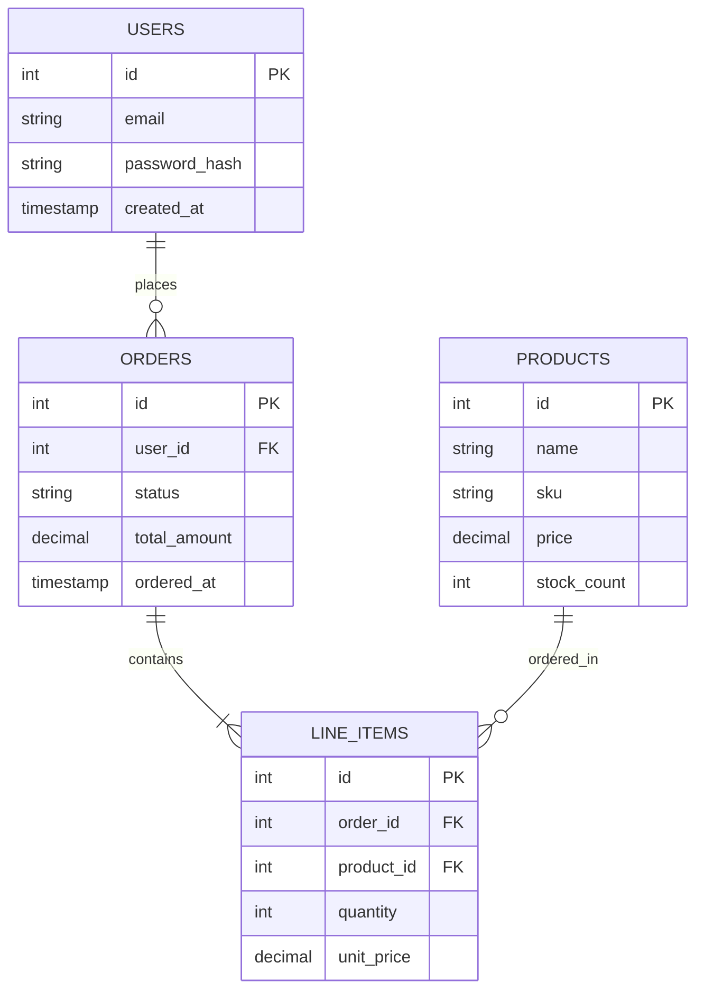

import Drawio from '@theme/Drawio';
import myGraph from '!!raw-loader!./diagrams/architecture1.drawio';

# Overzicht Architectuur

Ontdek de architectuur van de **RV Waarloos website in minder dan 5 minuten**.

## Entity-Relationship Diagram

The diagram below maps out the `USERS`, `ORDERS`, `LINE_ITEMS`, and `PRODUCTS` tables, highlighting their exact semantic relationships.

## Relationship Reference Legend

When reading the Mermaid ER notation above, notice the specific cardinality markers:
- `||--o{` represents a **One-to-Many** relationship (e.g., One user can place zero or many orders).
- `||--|{` represents a **One-to-At-Least-One** relationship (e.g., An order must contain at least one line item).

## Data Integrity Rules

1. **Cascading Deletes:** If a `USER` account is deleted, all associated `ORDERS` are soft-deleted via an asynchronous cron job.
2. **SKU Uniqueness:** The `sku` string field inside the `PRODUCTS` table enforces a strict unique database index constraint.

<Drawio content={myGraph} />
