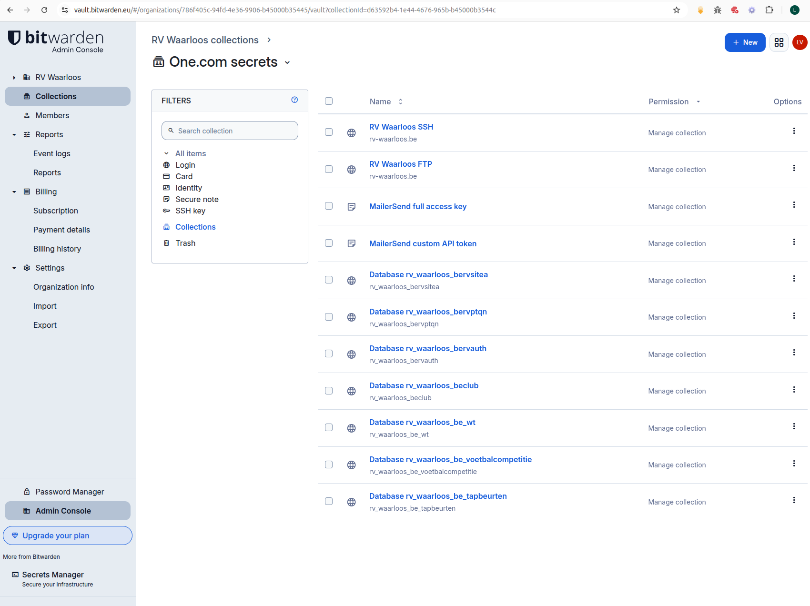

# Digitale Kluis - Wachtwoorden en andere gevoelige informatie veilig opslaan

Gevoelige informatie zoals wachtwoorden, API-sleutels en andere vertrouwelijke gegevens kunnen veilig worden opgeslagen in een digitale kluis. In deze handleiding wordt uitgelegd hoe u een digitale kluis kunt gebruiken om uw gevoelige informatie te beschermen.

# Bitwarden
Bitwarden is een populaire open-source digitale kluis die gebruikers in staat stelt om hun wachtwoorden en andere gevoelige informatie veilig op te slaan en te beheren. Bitwarden biedt zowel gratis als betaalde versies aan, met extra functies voor premium gebruikers.

Wij gebruken de gratis versie van Bitwarden, die voldoende functionaliteit biedt voor onze doeleinden.

Je kan inloggen op Bitwarden via de webinterface, mobiele apps of browserextensies. Het is belangrijk om een sterk hoofdwachtwoord te kiezen en tweefactorauthenticatie (2FA) in te schakelen voor extra beveiliging.

https://vault.bitwarden.eu/#/login

## Accounts

De gratis versie van Bitwarden biedt de mogelijkheid om twee accounts te maken. 

Deze accounts zijn toegewezen aan peter@geonet.be en luc.vankeer@telenet.be

## Wachtwoorden en toegangssleutels

De RV Waarloos vault (collection) bevat alle wachtwoorden en toegangssleutels gebruikt in de RV Waarloos omgeving.

